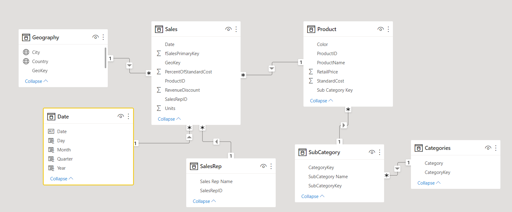
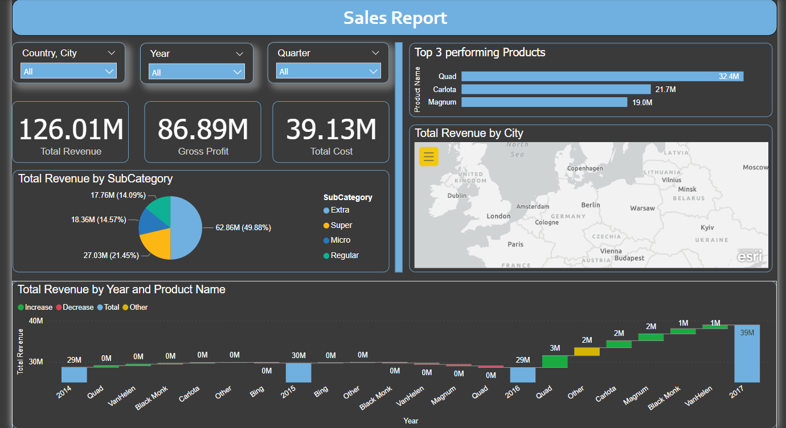

# Sales-Report

## Data Gathering :  
Assemble a sales reports with different visuals to best show the Sales Insights in one page Dashboard. 

  1-Sales (folder by year)
  2-Categories (Excel)
  3-Geography (Excel)
  4-Product (CSV / Database)
  5-SalesRep (Excel)
  6-SubCategories (Excel)
We loaded all the files from the sales folder in our model and then we merged the queries to get a single fact table.

## Data Transformation :  

First we split the location column in the geography table and the sales table to country and city so we could change its data type to allow Geo Maps.
Then we created a unique geokey to create the relationship between the two tables.

We also created a date table with this DAX formula :
```  
Date = CALENDAR(FIRSTDATE(Sales[Date]),LASTDATE(Sales[Date]))
```  

And we made some basic transformations to the rest of our columns.

## Data modeling :  



## Dax Measures :

### Total Revenue:      
```   
Total Revenue = SUMX(Sales,Sales[Units]*RELATED('Product'[RetailPrice]))
```    

### Total Cost:      
```   
Total Cost = SUMX(Sales,Sales[Units]*RELATED('Product'[StandardCost]))
```    

### Top performing products :      
```   
Top 3 performing Products per year = 
var prods=VALUES('Product'[ProductName])
return 
    CALCULATE([Total Revenue],
    TOPN(3,ALL('Product'[ProductName]),[Total Revenue],DESC),prods
    )
```  

### Gross Profit:      
```   
Gross Profit = CALCULATE([Total Revenue] - [Total Cost])
```  

### Gross Profit Last Month:      
```   
Gross profit Last Month = 
CALCULATE([Gross Profit],PARALLELPERIOD('Date'[Date],-1,MONTH))
```  

### Gross Profit Month over Month change:      
```   
Gross profit MoM growth Change% = IF(ISBLANK([Gross profit Last Month]),"N/A",
([Gross Profit] - [Gross profit Last Month])/([Gross profit Last Month]*100))
``` 

## The final dahsboard :   
The final one page sales management report.

    


